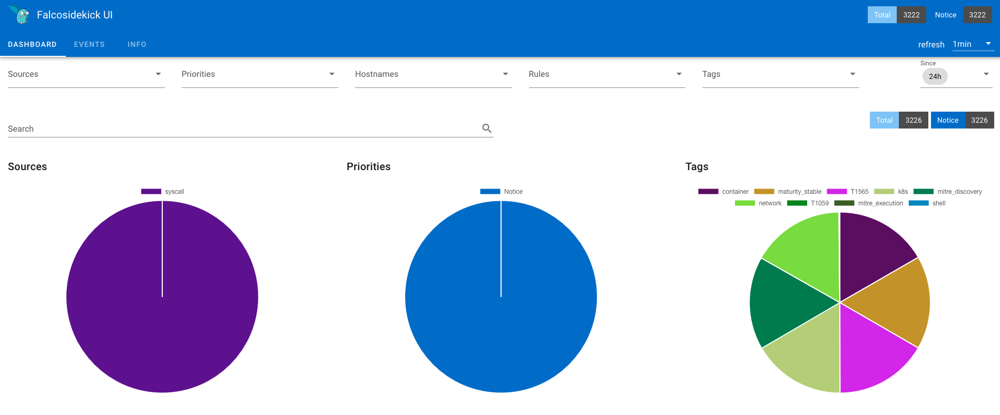
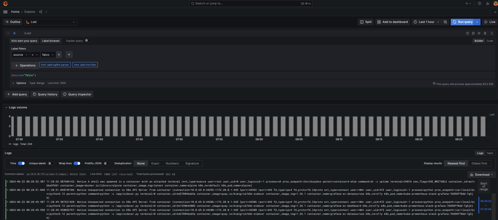

# Lab Falco

[](https://falco.org)

### Deploy with Helm

- Falco
- Falcosidekick exporting to Loki, Alertmanager and UI

> [!NOTE]
> Loki's setup using S3 for storage can be found at [o11y: OpenTelemetry, Prometheus, Loki e Tempo no EKS [Lab Session]](https://dev.to/aws-builders/o11y-opentelemetry-prometheus-loki-e-tempo-no-eks-lab-session-2o4b).

```sh
helm upgrade --install falco -n falco --create-namespace falcosecurity/falco \
  --set driver.kind=ebpf \
  --set tty=true \
  --set falcosidekick.enabled=true \
  --set falcosidekick.webui.enabled=true \
  --set falcosidekick.config.loki.hostport=http://loki-loki-distributed-gateway.o11y.svc.cluster.local:80 \
  --set falcosidekick.config.loki.endpoint=/loki/api/v1/push \
  --set falcosidekick.config.loki.minimumpriority=notice \
  --set falcosidekick.config.alertmanager.hostport=http://kube-prometheus-stack-alertmanager.o11y.svc.cluster.local:9093/ \
  --set falcosidekick.config.alertmanager.endpoint=/api/v1/alerts \
  --set falcosidekick.config.customfields="source:falco"
```
```sh
kubectl apply -f istio-ingress-falcosidekick.yaml
```



### Falco logs

```sh
kubectl logs -l app.kubernetes.io/name=falco -n falco -c falco
```
```sh
kubectl logs -l app.kubernetes.io/name=falco -n falco -c falco | grep Notice
```

### Simulate suspicious activity

```sh
kubectl run alpine --image alpine -- sh -c "sleep infinity"
```
```sh
kubectl exec -it alpine -- sh -c "uptime"
```



---

Official repo: https://github.com/falcosecurity/falco

---